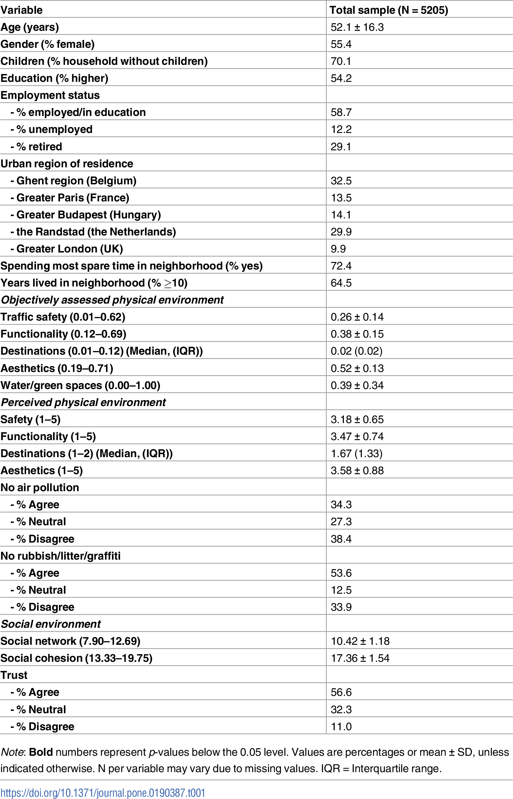
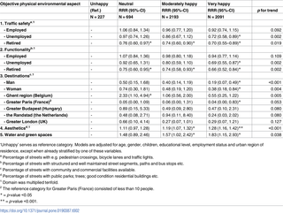
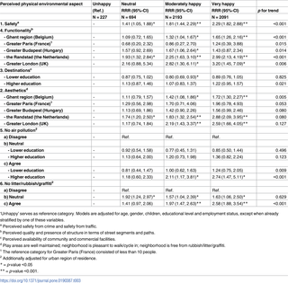
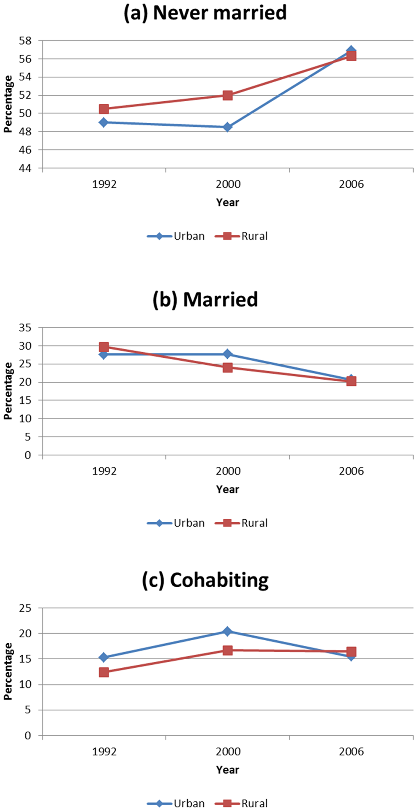
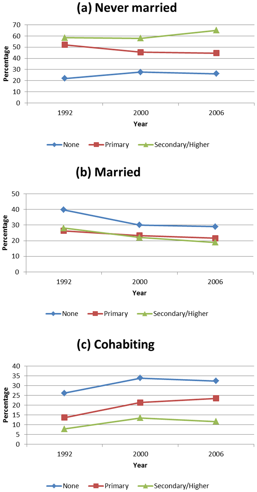

Homework 5

1. Examine a peer's research plan and provide feedback on hypothesis framework and type of test to use.

2. Pick two test types (I picked chi square and multiple regression) along with logistic regression and find papers that use these test methods. See table below for description of type and number of variables used and plots summarizing each paper's results.

3. Reproducing the analysis of the Hard to Employ program in New York: looking at 'ever employed in a CEO transitional job' and
'convicted of a felony'. Z and Chi-square tests were conducted against the null hypothesis, which was that the program had no effect
on different outcomes we were examining.

4. Conduct Pearson's, Spearman's, and a KS test on two samples of Citibike data for trip duration of bikes during the day and night. I looked at the month of February and June 2015.

| **Statistical Analyses**	|  **IV(s)**  |  **IV type(s)** |  **DV(s)**  |  **DV type(s)**  |  **Control Var** | **Control Var type**  | **Question to be answered** | **_H0_** | **alpha** | **link to paper**|
|:----------:|:----------|:------------|:-------------|:-------------|:------------|:------------- |:------------------|:----:|:-------:|:-------|
Chi square	| 1, Gender | categorical, dichotomous | 1, Color choice | categorical, nominal | no control variables | no control variables | Does gender affect color choice in treatment of visual stress | Effect of gender <=0 | 0.04 | [Does Gender Influence Colour Choice in the Treatment of Visual Stress? ](https://journals.plos.org/plosone/article?id=10.1371/journal.pone.0163326#pone-0163326-g002) |
  |||||||||
Multiple regression	| 14, perceived and objective neighborhood attributes | categorical, nominal | 1, Happiness | categorical, ordinal | no control variables | no control variables | Do different neighborhood attributes effect happiness | Effect of attributes on happiness = 0 | 0.05 | [Contextual correlates of happiness in European adults ](https://journals.plos.org/plosone/article?id=10.1371/journal.pone.0190387) |
  |||||||||
Logistic regression	| 8, year, education, religion, employment, residence, wealth index, region, age | categorical, nominal | 3, Never married, ever married, cohabiting | categorical | no control variables | no control variables | If time has changed marital patterns and trends in Namibia | change in martial status over time = 0 | 0.05 | [Explaining martial patterns and trends in Namibia ](https://journals.plos.org/plosone/article?id=10.1371/journal.pone.0070394) |
  |||||||||

Paper 1 Main Results

Paper 2 Main Results

Paper 3 Main results

