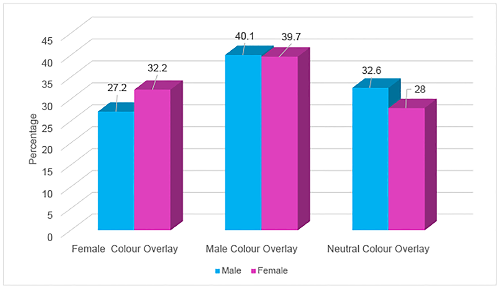
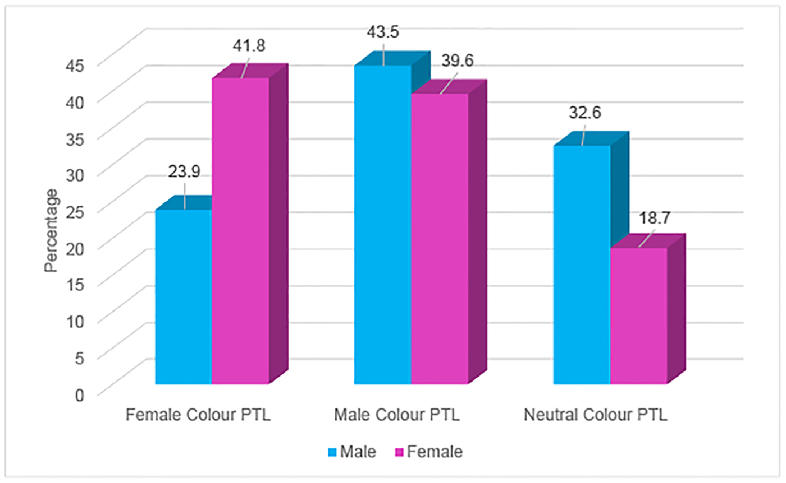

Homework 5

1. Examine a peer's research plan and provide feedback on hypothesis framework and type of test to use.

2. Pick two test types (I picked chi square and path analysis) and find papers that use
these test methods. See table below for description of type and number of variables used and plots summarizing each paper's results.

3.

4.

| **Statistical Analyses**	|  **IV(s)**  |  **IV type(s)** |  **DV(s)**  |  **DV type(s)**  |  **Control Var** | **Control Var type**  | **Question to be answered** | **_H0_** | **alpha** | **link to paper**|
|:----------:|:----------|:------------|:-------------|:-------------|:------------|:------------- |:------------------|:----:|:-------:|:-------|
Chi square	| 1, Gender | categorical, dichotomous | 1, Color choice | categorical, nominal | no control variables | Does gender affect color choice in treatment of visual stress | Effect of gender <=0 | 0.04 | [Does Gender Influence Colour Choice in the Treatment of Visual Stress? ](https://journals.plos.org/plosone/article?id=10.1371/journal.pone.0163326#pone-0163326-g002) |
  |||||||||
Multiple regression	| 14, perceived and objective neighborhood attributes | categorical, nominal | 1, Happiness | categorical, ordinal | no control variables | Do different neighborhood attributes effect happiness | Attributes on happiness = 0 | 0.05 | [Contextual correlates of happiness in European adults ](https://journals.plos.org/plosone/article?id=10.1371/journal.pone.0190387) |
  |||||||||

Paper 1 Main Results

Paper 2 Main Results
