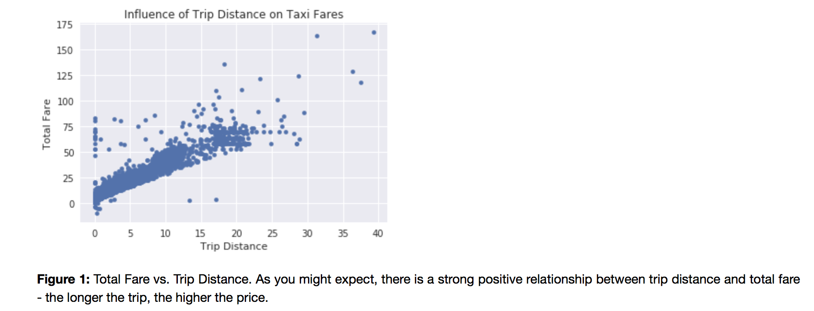

For Assignment 1, we were instructed to make a plot. I chose to plot NYC Taxi data
showing the relationship between trip distance and total fare. 

For Assignment 2, we completed our CitiBike analysis from HW4. 

A copy of my report on Authorea can be found here: 
https://www.authorea.com/users/249600/articles/335930-title#

