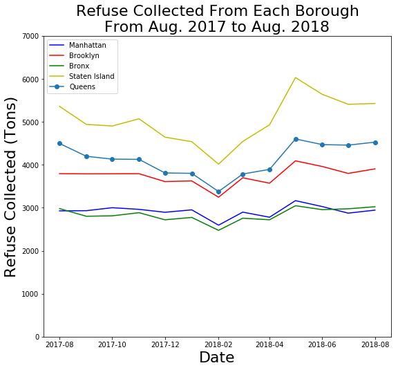

I reviewed for below plot for Andrew:

**Clarity**: The plot gets all clarity points; labels, legend, title, and axes are all clear.

**Esthetic**: It was smart to use different colors for each borough, I think it makes your point even quicker. It also makes a lot prettier than just black and white. Not sure if there is a significance to the Queens line having circles.

**Honesty**: The plot is honest and straightforward.

Suggestions:

- Refuse collection per person in each borough might be interesting.
- Including some conjecture about why Staten Island has the most refuse could improve your caption, since it is pretty surprising that Staten Island is first in refuse collection.
- Plotting refuse collection over a longer time period could be interesting as well, if data are available.
- This is my personal preference, but I would resize your x and y labels to be smaller than your title.
