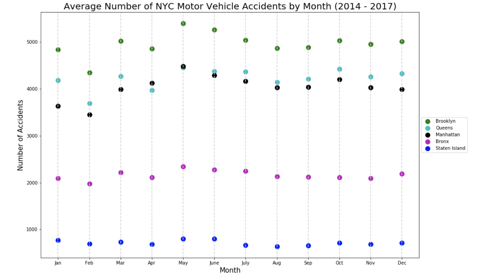

I reviewed for below plot for Eve:

**Clarity**: The plot gets full points for clarity.

**Esthetic**: The use of color is smart and just the right amount to create some visually appealing elements for the plot. I think the use of the vertical lines was smart as well since they are five points for each month.

**Honesty**: I think the data are honestly presented.

Suggestions:

- Accidents per person in each borough would be an interesting element to present rather than absolute counts.
- I might make the circles you use for data points a bit bigger; there is one instance in May where the Queens and Manhattan points are almost on top of each other, and it might be easier to see that they are both there if they are a larger.
- The colors for the Bronx and Brooklyn data points may look the same to those who are red-green color blind.
